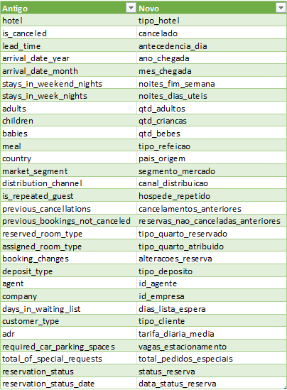
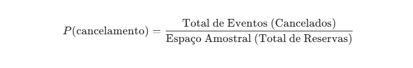
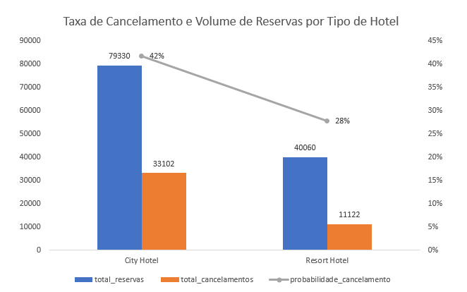

# 🏨 Estudo de Caso: Análise Estatística de Cancelamentos Hoteleiros

## 📌 Visão Geral do Projeto
Este projeto analisa uma base histórica de **119.390 reservas** de hotéis para identificar padrões de cancelamento e fornecer insights estratégicos para a gestão de receitas (**Revenue Management**). O foco inicial foi a estruturação de um pipeline de dados confiável e a medição do risco macro por unidade de negócio.

> **Nota de Status:** Este estudo de caso está sendo construído em etapas. Atualmente, concluímos o tratamento de dados (ETL) e a análise de probabilidade geral.

---

## 🛠️ Fase 1: Engenharia de Dados e ETL
Para garantir análises precisas, utilizei o **Power Query (Linguagem M)** para realizar uma limpeza rigorosa dos dados. As etapas principais foram:

* **Padronização Dinâmica:** Implementação de uma matriz de tradução (De-Para) via código para converter cabeçalhos originais para o padrão **snake_case**.
* **Integridade do Espaço Amostral:** Identificação de erros na coluna `qtd_criancas` e tratamento de valores nulos em IDs de agentes e empresas, utilizando técnicas de imputação para preservar o tamanho da amostra.
* **Documentação Técnica:** O código da Linguagem M foi totalmente comentado para garantir a transparência do processo de limpeza.

---

## 📊 Análise de Probabilidade (Resultados Iniciais)
Nesta etapa, aplicamos o conceito de **Probabilidade Frequentista** para entender o comportamento de risco de cada hotel:

### **Descobertas Principais:**
* **City Hotel:** Probabilidade de cancelamento de **42%**.
* **Resort Hotel:** Probabilidade de cancelamento de **28%**.

---

## 💡 Insights de Negócio
A disparidade de **14 pontos percentuais** entre as unidades indica que o **City Hotel** possui um ambiente de reserva muito mais volátil. 
* **Recomendação:** A unidade urbana deve adotar políticas de cancelamento mais rígidas e depósitos não reembolsáveis com maior frequência para mitigar o risco operacional.

---

## 📂 Organização do Repositório
* `/dados`: Base original e referências.
* `/documentacao`: Dicionário de dados e matriz de tradução.
* `/Imagens`: Gráficos e evidências visuais da análise.
* `/scripts`: Código em Linguagem M documentado linha a linha.

---

## 🚀 Próximos Passos
As próximas atualizações focarão em:
1.  **Probabilidade Condicional:** O impacto do `lead_time` (antecedência) no cancelamento.
2.  **Análise de Valor Esperado:** Estimativa de impacto financeiro por reserva perdida.

---

### Como reproduzir:
O código completo da limpeza de dados está disponível na pasta `scripts/`. O arquivo principal do Excel com o Dashboard inicial também está na raiz do repositório.
